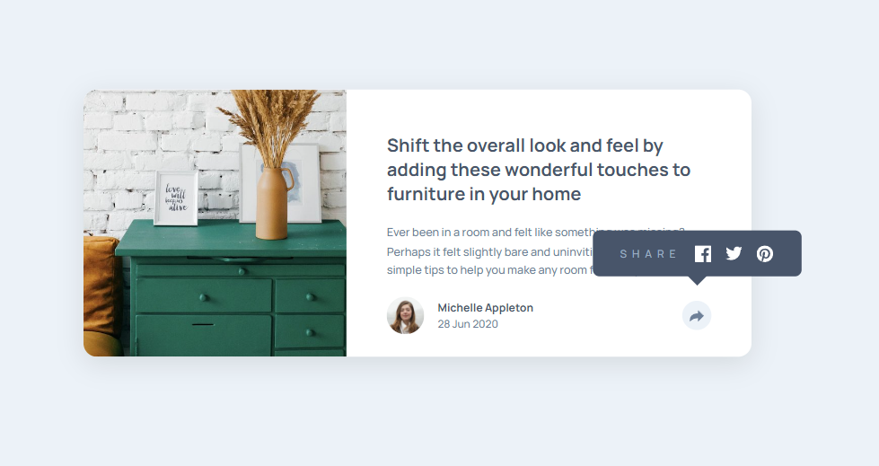
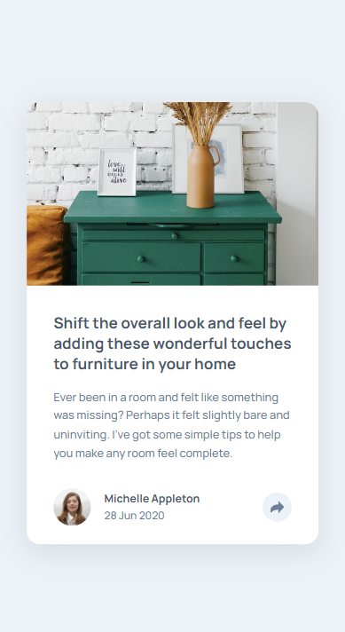

# Article Preview Component

*Caption: Desktop view of the Article Preview Component*

*Caption: Mobile view of the Article Preview Component*

I created an Article Preview Component as part of the [Frontend Mentor](https://www.frontendmentor.io/challenges/article-preview-component-dYBN_pYFT) challenge. A simple design for an article with animation when the share button is clicked

## Link

You can see a live demo of the Article Preview Component [here](https://lawrpunk.github.io/article-preview-component/).

## Features

- When the share button is clicked a popup appears

## Technologies Used

- HTML
- CSS
- JavaScript

## Acknowledgments

- [Frontend Mentor](https://www.frontendmentor.io/) for the challenge

